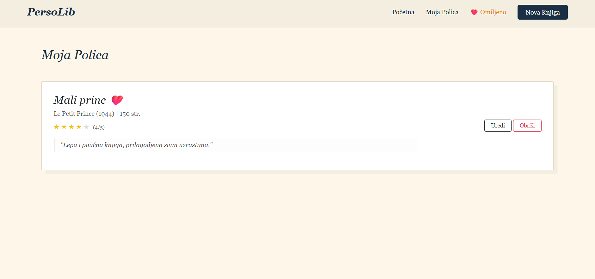

# Personal Library Manager 📚

A web application for managing a personal book collection, developed as a course project for **Web Programming 1** at the Academy of Professional Studies Šumadija.

## 🚀 Technologies Used
* **PHP & Laravel Framework** - Backend logic and route management
* **Blade (Laravel View Engine)** - Dynamic template creation
* **SQLite** - Database management (books, authors, genres)
* **Bootstrap 5 & CSS3** - Responsive styling and UI design

## ✨ Features
* **Full CRUD Operations:** Add, view, edit, and delete books from the database.
* **Categorization:** Organize book titles efficiently by genres and authors.
* **Search Functionality:** Quickly find specific books within the collection.
* **Form Validation:** Secure data entry using Laravel's built-in validation.

## 📸 Application Preview

